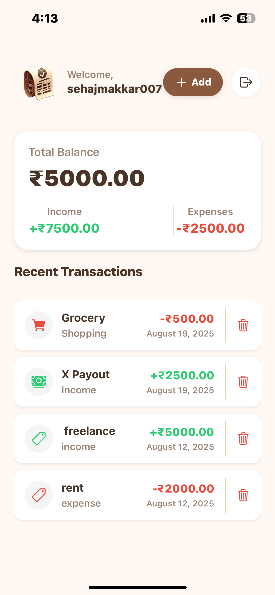
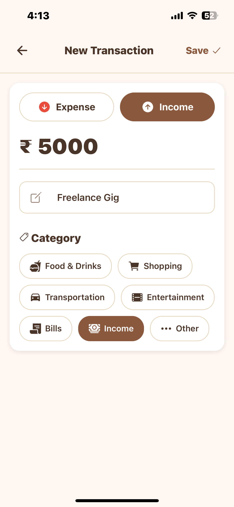

## What is CashFlowr?

**CashFlowr** is a cross-platform expense tracker that helps you take control of your money by tracking income, expenses, and balances — all in one simple, secure app. Built with modern technologies like **React Native**, **Express.js**, **PostgreSQL**, and **Clerk Authentication**, it provides a seamless experience across both iOS and Android devices.

Whether you're budgeting for the month, tracking daily expenses, or managing your income streams, CashFlowr makes financial management intuitive and accessible.

---

 

## Demo

  <video 
    width="400" 
    height="600" 
    muted
    autoPlay
    loop 
    style={{ borderRadius: '12px', boxShadow: '0 4px 20px rgba(0,0,0,0.1)' }}
  >
    <source src="./assets/cashflowr/casDemo.mp4" type="video/mp4" />
    Your browser does not support the video tag.
  </video>

---

 

## User Interface

  
  
  

---

## Key Features

1. **Secure Authentication**  
   Built-in Clerk Authentication system with sign up, login, and logout functionality to keep your financial data safe and private.

2. **Comprehensive Transaction Tracking**  
   Track both income and expenses with customizable categories, making it easy to see where your money comes from and where it goes.

3. **Real-time Balance Overview**  
   Get instant insights into your financial health with live calculations of total income, expenses, and remaining balance.

4. **Full CRUD Operations**  
   Add, edit, and delete transactions with ease. Keep your financial records accurate and up-to-date.

5. **Cross-platform Compatibility**  
   Works seamlessly on both iOS and Android devices thanks to React Native and Expo, ensuring you can manage your finances anywhere.

6. **Persistent Data Storage**  
   All your financial data is securely stored in PostgreSQL database with robust backend APIs built using Express.js.

---

## Tech Stack

- **Frontend:** React Native with Expo for cross-platform mobile development
- **Backend:** Express.js REST API server
- **Database:** PostgreSQL for reliable data persistence
- **Authentication:** Clerk for secure user management
- **Platform:** iOS & Android support

---

## Getting Started

### Prerequisites
- Node.js (>= 18)
- PostgreSQL installed & running
- Clerk account with API keys
- Expo CLI for React Native development

### Installation
1. Clone the repository
2. Install dependencies for both frontend and backend
3. Set up PostgreSQL database
4. Configure Clerk authentication keys
5. Start the Express.js server
6. Launch the React Native app with Expo

---

## Contact

- **GitHub**: [sehajmakkar](https://github.com/sehajmakkar)
- **Email**: [sehajmakkar007@gmail.com](mailto:sehajmakkar007@gmail.com)
- **X/Twitter**: [@sehajmakkarr](https://x.com/sehajmakkarr)

---