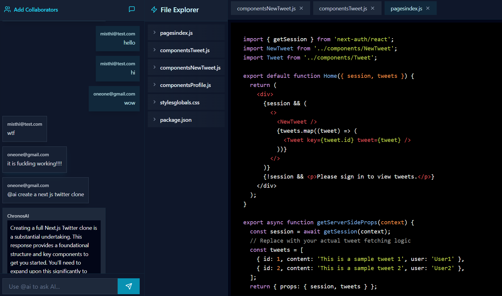

## Overview

**ChronosAI** is a full-stack developer platform that merges real-time AI-assisted coding with team collaboration capabilities. Designed for engineers, product builders, and learners, it transforms abstract ideas into structured, functional codebases with minimal manual effort. By combining conversational AI, live collaboration, and intelligent project scaffolding, ChronosAI offers a streamlined, scalable development environment built for speed and productivity.

 
<video
  muted
  autoPlay
  loop
  className="w-full rounded-lg border aspect-video"
  poster="./assets/chronosai/chr1.png"
>
  <source src="./assets/chronosai/chrDemo.mov" type="video/mp4" />
</video>

---

## Platform Preview

  
_Figure 1: AI-assisted command execution and intelligent code generation interface._

---

## Key Capabilities

1. **Intelligent Project Scaffolding**  
   Developers can describe an app idea (e.g., “a real-time chat with authentication”), and ChronosAI generates a complete directory structure and starter code tailored to that use case.

2. **Real-Time AI-Powered Chat**  
   Integrated with Google’s Gemini API, ChronosAI provides conversational support for code generation, debugging, architecture decisions, and documentation writing.

3. **Live Collaboration Environment**  
   Built-in socket-based infrastructure enables real-time communication and editing. Teammates can chat, review code, and co-develop within the same session.

4. **Instant Code Review and Suggestions**  
   Developers receive AI-driven code quality feedback and optimization suggestions while writing or pasting code.

5. **Multi-Modal Communication Layer**  
   Code snippets, system prompts, and team discussions are unified in a persistent collaborative workspace.

6. **Streamlined Architecture**  
   Full separation of concerns between frontend and backend, built with scalability and extensibility in mind.

---

## Technology Stack

- **Frontend**: React (Vite), TailwindCSS
- **Backend**: Node.js, Express.js
- **Database**: MongoDB with Mongoose
- **Real-time Communication**: Socket.io
- **AI Integration**: Google Gemini API
- **Caching Layer**: Redis

The frontend and backend are modularized and container-ready, allowing for rapid deployment and horizontal scaling in multi-user environments.

---

## Contribution

ChronosAI is an open-source initiative aimed at building more fluid and AI-augmented developer experiences. Contributions are welcome—whether in feature development, UX design, bug fixes, or performance tuning.

View the repository: [GitHub – sehajmakkar/ChronosAI](https://github.com/sehajmakkar/ChronosAI)

---

## Contact

- **GitHub**: [sehajmakkar](https://github.com/sehajmakkar)
- **X/Twitter**: [@sehajmakkarr](https://x.com/sehajmakkarr)
- **Email**: [sehajmakkar007@gmail.com](mailto:sehajmakkar007@gmail.com)

---

_ChronosAI is designed to empower developers by combining automation, collaboration, and intelligent assistance into a single development environment._
