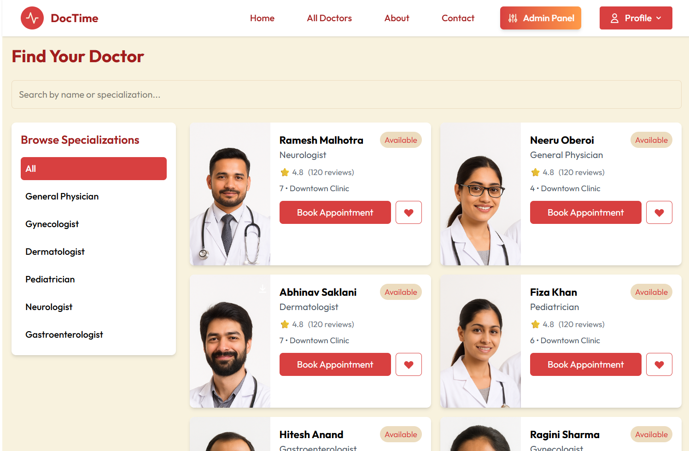
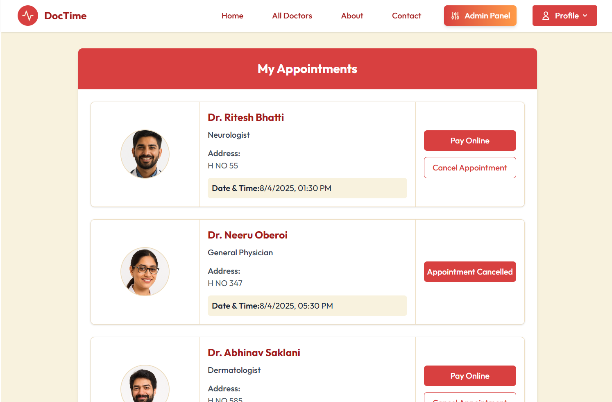
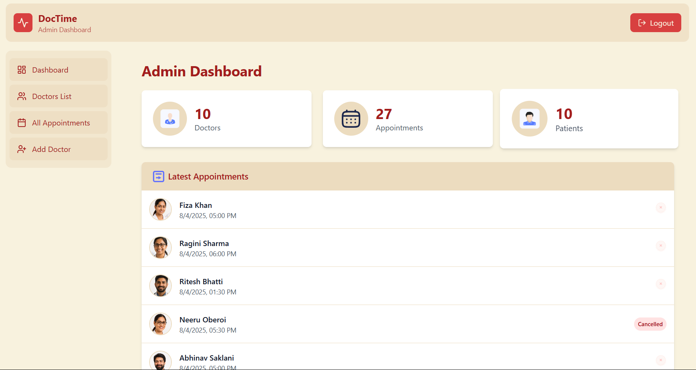
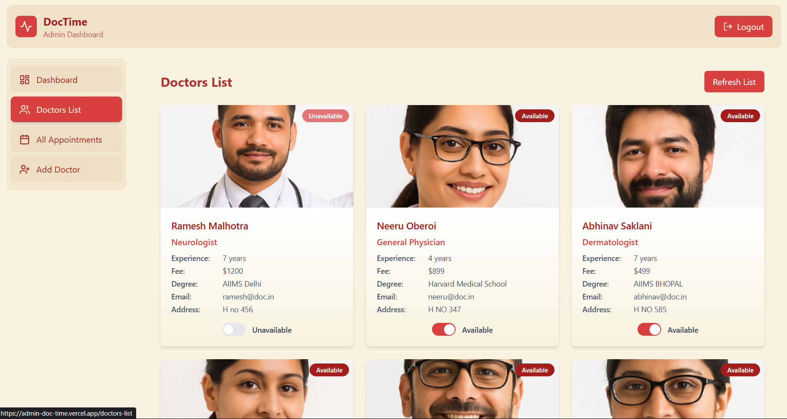

## What is DocTime?

**DocTime** is a full-stack appointment management platform designed for the healthcare sector, supporting **role-based access control (RBAC)** across three distinct panels: user, doctor, and admin. With dedicated interfaces and functionalities for each role, DocTime enables seamless patient-doctor interaction, streamlined appointment scheduling, and centralized administrative oversight.

---

## Feature Preview

 

  
  
  
  

---

## System Features

1. **Role-Based Access Control (RBAC)**  
   Every route and interface is protected according to user role, ensuring secure and context-appropriate access.

2. **Separation of Concerns via Multi-Panel Design**  
   Individual frontends for users and admins enable clean separation of concerns, improving both scalability and maintainability.

3. **Dynamic Doctor Search and Booking**  
   Users can filter doctors by specialization and availability, then seamlessly book appointments with real-time updates.

4. **Doctor Availability Management**  
   Doctors can define their schedules, block off times, and manage consultations directly from their dashboards.

5. **Administrative Control and Analytics**  
   Admins can approve doctors, track global appointments, manage specializations, and access platform-wide metrics.

6. **Cloud Integration for Media Storage**  
   Profile and certification uploads are stored securely using **Cloudinary**, with **Multer** handling upload processing.

---

## Technology Stack

**Frontend**

- **React.js** – Component-based user interface
- **Vite** – Lightning-fast build tool and development server
- **CSS3** – Modular styling and UI responsiveness
- **Context API** – Lightweight state management

**Backend**

- **Node.js** – Asynchronous runtime for scalable server logic
- **Express.js** – RESTful API routing and middleware management
- **MongoDB with Mongoose** – NoSQL database schema design

**Supporting Libraries and Services**

- **Cloudinary** – Cloud-hosted image storage and CDN
- **Multer** – Middleware for handling file uploads
- **JWT (JSON Web Tokens)** – Secure token-based authentication
- **bcrypt** – Password hashing for credential security

---

## Authentication and Access Control

DocTime implements a secure authentication and authorization flow:

- **JWT-based authentication** ensures tokenized access for all user types.
- Middleware enforces access control policies based on assigned roles.
- Sensitive routes are protected using scoped route guards to prevent unauthorized data access or manipulation.

Each user role operates on an isolated interface and API layer, minimizing risk and maintaining a coherent permission boundary.

---

## Contribution

DocTime is open to community contributions. Developers can extend functionality across any panel, improve RBAC workflows, integrate payment systems, or enhance analytics.

Visit the repository to get started:  
[GitHub – sehajmakkar/DocTime](https://github.com/sehajmakkar/DocTime)

---

## Contact

- **GitHub**: [sehajmakkar](https://github.com/sehajmakkar)
- **Email**: [sehajmakkar007@gmail.com](mailto:sehajmakkar007@gmail.com)
- **X (Twitter)**: [@sehajmakkarr](https://x.com/sehajmakkarr)

---

_DocTime provides a scalable, production-ready foundation for healthcare appointment management, with emphasis on user segmentation, modular architecture, and secure operational workflows._
