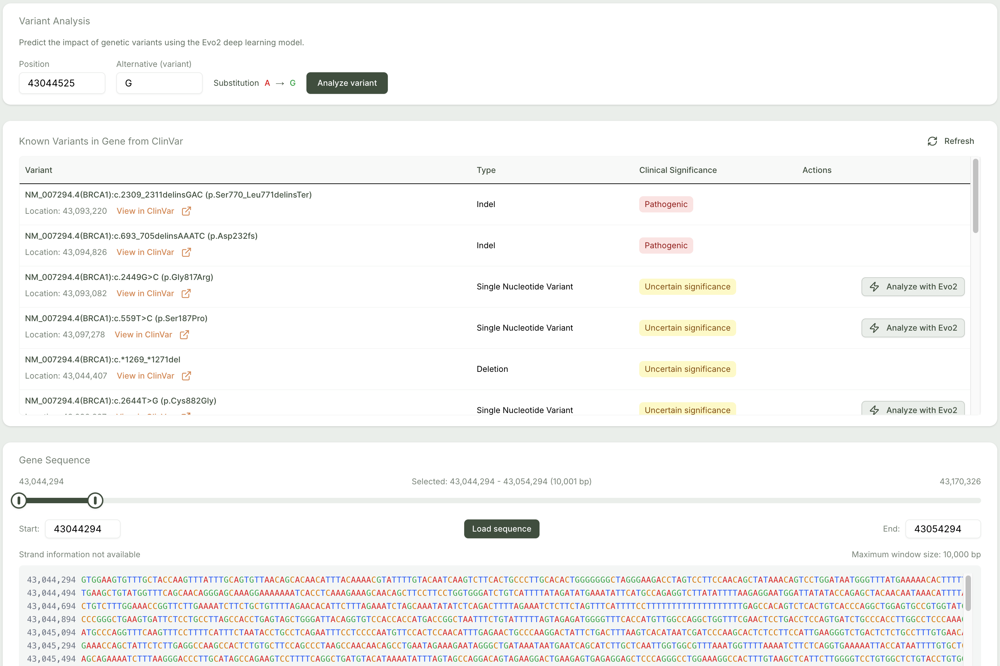
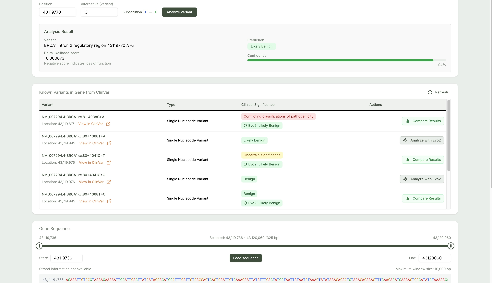

## Overview

**GenomicsAI** is a full-stack AI-powered web platform for interpreting genetic mutations at scale. It leverages the **Evo 2 genomic language model**—a transformer-based model trained on over 9 trillion nucleotides—to accurately predict whether single nucleotide variants (SNVs) are likely to be pathogenic. The platform is engineered for clinicians, bioinformaticians, and researchers aiming to accelerate genetic variant classification in clinical and research pipelines.

 
<video
  muted
  autoPlay
  loop
  className="w-full rounded-lg border aspect-video"
  poster="./assets/genomicsai/gen1.png"
>
  <source src="./assets/genomicsai/genDemo.mp4" type="video/mp4" />
</video>

---

## Problem Context

In clinical genomics, interpreting the functional impact of genetic mutations—especially **single nucleotide variants (SNVs)**—remains a significant bottleneck. Current challenges include:

- **Variants of Uncertain Significance (VUS):** A substantial percentage of detected variants cannot be classified as benign or pathogenic due to lack of data.
- **Latency in Clinical Validation:** Confirming the pathogenicity of variants typically requires longitudinal clinical studies, functional assays, or case-control analyses—processes that are expensive and time-intensive.
- **Manual Curation Limitations:** Relying solely on databases such as ClinVar or literature searches often yields incomplete or outdated interpretations.
- **Scaling Interpretation Pipelines:** Most labs lack scalable, real-time computational tools to support genome-wide variant analysis.

---

## Solution

GenomicsAI addresses these limitations by providing a **real-time, AI-powered platform** for predicting the pathogenicity of SNVs. Built on a serverless, GPU-accelerated architecture, it allows users to:

- Rapidly **input and analyze SNVs** using the Evo 2 model, which captures evolutionary and functional context.
- **Compare predictions** against existing clinical evidence from authoritative sources like **ClinVar**.
- Interact with reference gene sequences and genomic coordinates using data from the **UCSC Genome Browser API**.
- Receive **confidence metrics** that quantify the likelihood of a prediction being correct, aiding downstream decision-making in clinical genomics workflows.

This platform shifts variant interpretation from slow, manual evaluation to high-throughput, AI-assisted triage—bridging the gap between raw genomic data and clinical insight.

---

## Demonstration

  
_Figure 1: Interactive gene sequence viewer and variant input interface._

  
_Figure 2: Evo 2 model predictions contextualized alongside ClinVar database annotations._

---

## Key Features

1. **AI-Based Variant Pathogenicity Prediction**  
   Submit SNVs (e.g., G → A at chr13:32972790) and receive Evo 2 model outputs classifying the variant as likely benign or pathogenic.

2. **ClinVar Integration**  
   Predictions are mapped against entries from the **NCBI ClinVar** database to show known clinical assertions for the queried variant.

3. **Gene Search and Genomic Navigation**  
   Users can search by gene symbols (e.g., TP53, BRCA1) or browse genomic regions by coordinates. Reference sequences are rendered interactively using UCSC API data.

4. **Interactive Sequence Viewer**  
   Visualize gene-level DNA sequences, zoom into specific positions, and annotate them with mutation details.

5. **Prediction Confidence Scores**  
   Each AI prediction includes a numerical confidence score derived from Evo 2’s model logits, assisting in result prioritization.

6. **High-Performance, Serverless Backend**  
   Inference is executed on H100 GPUs using **Modal**, allowing for fast, scalable, and cost-effective predictions.

7. **Fully Responsive UI**  
   Built with **Next.js 15**, **TypeScript**, and **Shadcn UI**, the interface is optimized for both research-grade usability and mobile responsiveness.

---

## Technology Stack

- **AI Model**: Evo 2 (Stanford, UCSF, Berkeley, NVIDIA)
- **Frontend**: Next.js 15, React, TypeScript, Tailwind CSS, Shadcn UI
- **Backend**: Python, FastAPI, serverless runtime on Modal (H100 GPU)
- **Data Sources**: UCSC Genome Browser, NCBI E-utilities, ClinVar

---

## The Evo 2 Model

At the core of GenomicsAI is **Evo 2**, a transformer-based genomic language model purpose-built for modeling DNA sequences and predicting mutational impacts.

- **Training Corpus**: 9.3 trillion nucleotides across 128,000 species
- **Architectural Foundation**: Transformer blocks with tokenization tailored for genomic alphabets
- **Capabilities**: Mutation impact prediction, de novo genome sequence generation, and in silico genome design
- **Research Origin**: Developed by Stanford University, UC Berkeley, UCSF, and NVIDIA ([View Paper](https://www.biorxiv.org/content/10.1101/2025.02.18.638918v1.full.pdf))

---

## Contribution

GenomicsAI is an open-source initiative built to advance genomic research and AI-assisted variant interpretation. Contributions are welcomed across all areas—frontend, backend, model integration, UI design, and data pipeline improvements.

Explore the repository: [GitHub – sehajmakkar/GenomicsAI](https://github.com/sehajmakkar/GenomicsAI)

---

## Contact

- **GitHub**: [sehajmakkar](https://github.com/sehajmakkar)
- **Email**: [sehajmakkar007@gmail.com](mailto:sehajmakkar007@gmail.com)
- **X/Twitter**: [@sehajmakkarr](https://x.com/sehajmakkarr)

---

_GenomicsAI is purpose-built to reduce interpretation latency in genomics workflows through the integration of scalable infrastructure and cutting-edge AI._
