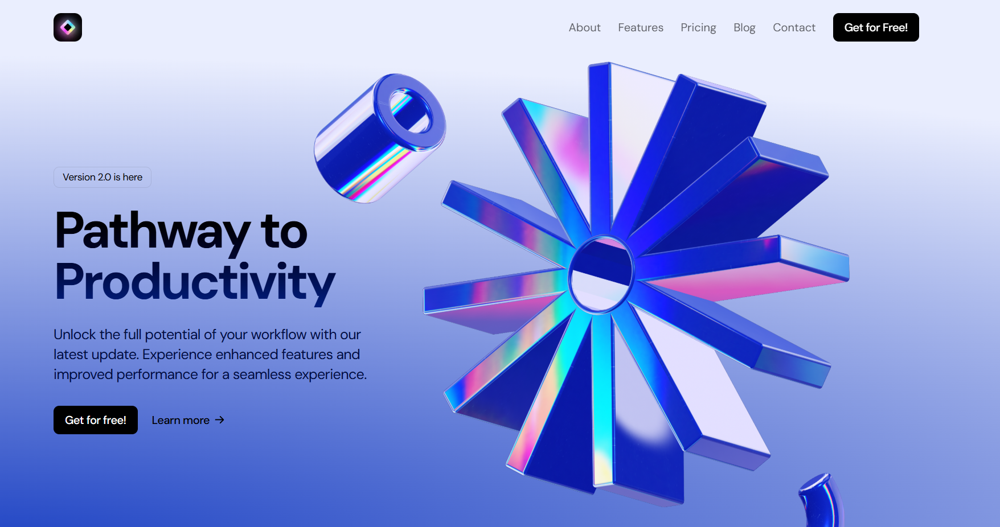
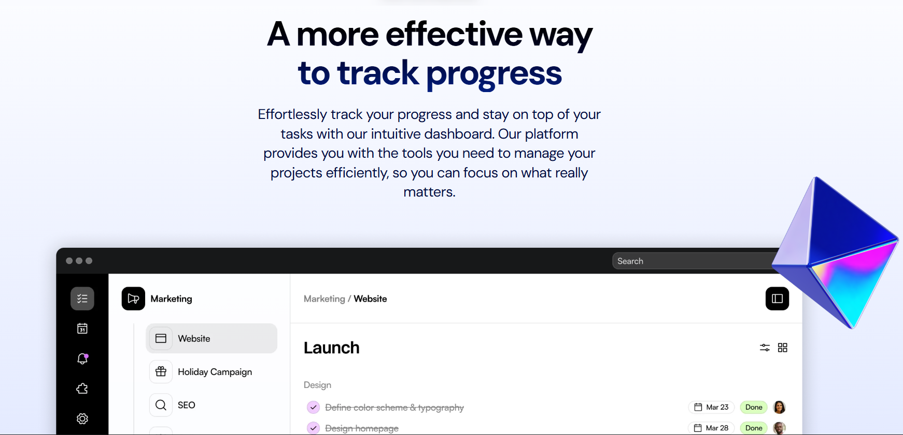
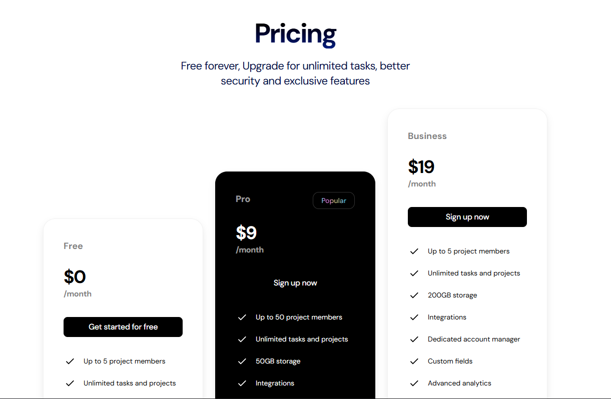
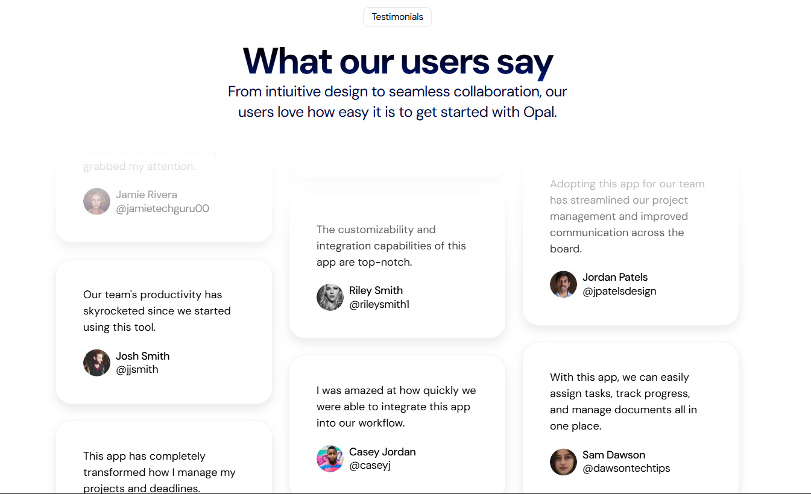

 
## User Interface

 
  
 
  
 
 
  
 
  

## Contact

- **GitHub**: [sehajmakkar](https://github.com/sehajmakkar)
- **Email**: [sehajmakkar007@gmail.com](mailto:sehajmakkar007@gmail.com)
- **X/Twitter**: [@sehajmakkarr](https://x.com/sehajmakkarr)

---