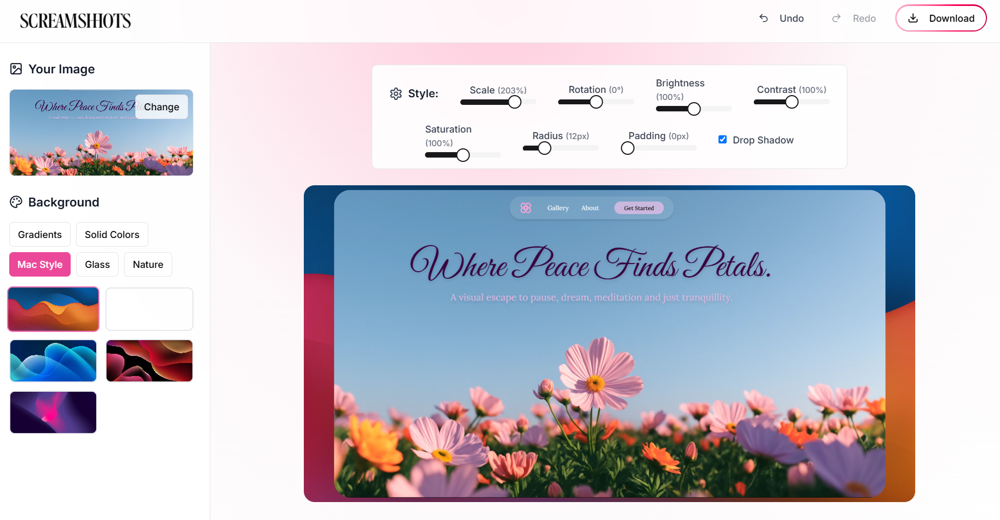
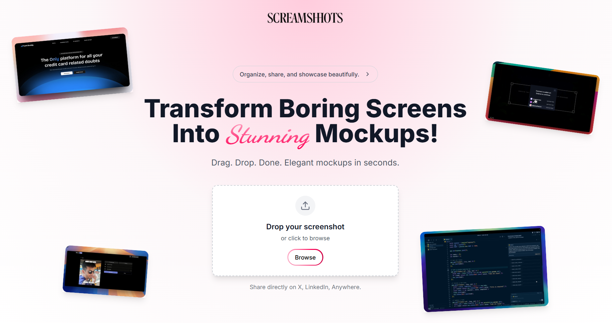

## What is ScreamShots?

**ScreamShots** is a fun and minimal web tool to turn your boring screenshots into stunning, share-worthy mockups in seconds. Whether you're a developer, designer, or just love aesthetics — this tool helps you frame your screen grabs beautifully with gradient backgrounds, soft shadows, and stylish effects.

Built using **Next.js**, **TypeScript**, and **Framer Motion**, the app is blazing fast, accessible, and fun to use.

---

 

## User Interface

  
*Editing your screenshot with mac-style gradients and drop shadows*

  
*Homepage showcasing the instant drag-drop mockup feature*

---

## Key Features

1. **Instant Screenshot Styling**  
   Upload or drag a screenshot and get an instant stylized mockup with gradient, glass, and nature-themed backgrounds.

2. **Live Style Customization**  
   Tweak brightness, contrast, scale, radius, and drop shadows — all in real-time with intuitive sliders.

3. **Download-Ready**  
   One-click download button provides your finished mockup, ready to be shared on LinkedIn, X (Twitter), or portfolios.

4. **Smooth Animations with Framer Motion**  
   Subtle and snappy animations throughout for a delightful user experience.

5. **No Login Required**  
   Completely free and privacy-respecting — just drop your image and go.

---

## Contact

- **GitHub**: [sehajmakkar](https://github.com/sehajmakkar)
- **Email**: [sehajmakkar007@gmail.com](mailto:sehajmakkar007@gmail.com)
- **X/Twitter**: [@sehajmakkarr](https://x.com/sehajmakkarr)

---
